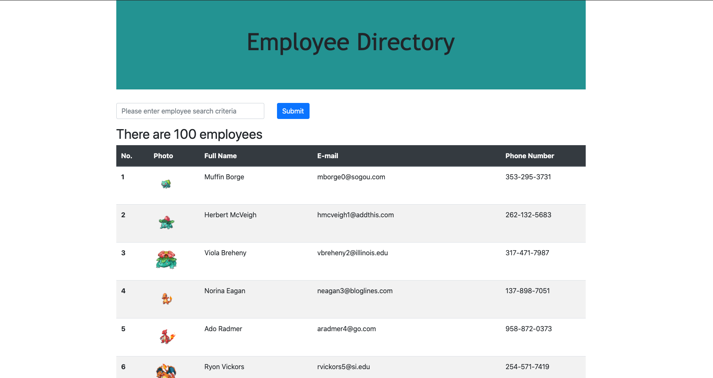

# React Employee Directory

https://radiant-island-45826.herokuapp.com/

## Description

The purpose of this project was to create an employee directory using React. Users can search through the directory by any relevant parameters (name, email, phone number) to filter through employees. Technologies used include Node, React, Regex, and Mockaroo.com for the Api calls.

## User Story

AS A user, I want to search the employee directory\
I WANT to enter an employees's information\
SO THAT I can find an employee

## License

Distributed under the MIT license.